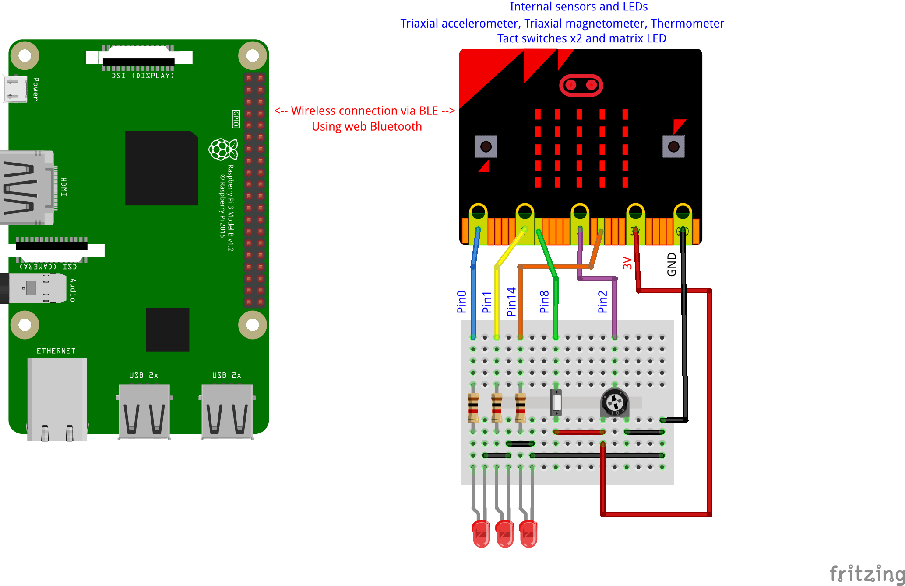

# [webGPIO-etc-on-microbit-via-webBluetooth](http://chirimen.org/webGPIO-etc-on-microbit-via-webBluetooth/) #
 [micro:bit](https://ja.wikipedia.org/wiki/BBC_Micro:bit)内蔵のセンサーやLED、スイッチ、GPIOポートを、[web bluetooth](https://webbluetoothcg.github.io/web-bluetooth/)API経由でウェブアプリから使う。専用ライブラリが用意されており比較的簡単にコーディングできる。GPIOポートAPIは[webGPIO](https://rawgit.com/browserobo/WebGPIO/master/index.html)に準拠、拡張機能としてアナログ入力に対応。[CHIRIMEN for RPi3](https://chirimen.org/chirimen-raspi3/)のGPIO,I2Cとも同時利用可能。

[micro:bit](https://ja.wikipedia.org/wiki/BBC_Micro:bit)は、子供向けの教育用ボードコンピュータですが、Bluetooth搭載で、たくさんのセンサーや表示装置、さらにGPIO端子も載っています。コストパフォーマンスも入手性も良いと思いますので、Bluetoothを用いたIoTのプロトタイピングで、ワイヤレスのセンサーやアクチュエーターなどとして便利に活用できると思います。

## Code on micro:bit (slave) ##
* まず、micro:bit側に以下のコードをロードします。
  * [https://makecode.microbit.org/_YHtdtK9kt9Rz](https://makecode.microbit.org/_YHtdtK9kt9Rz)
  * 上記をtypeScriptにしたソースを念のため置いておきます。[microbitFirmware.js](microbitFirmware.js)
  * 癖があるjavascriptの環境ですが、CHIRIMENによるIoTの学習的には他の小型のボードコンピュータよりは言語や開発環境の統一の面で良いと思います

## WebApps on Host Computer (master) ##
* **[ためしてみる](https://chirimen.org/webGPIO-etc-on-microbit-via-webBluetooth/example.html)**
* [microBitBLE.js](microBitBLE.js)がmicro:bitのセンサなどやGPIOピンをWebBluetooth経由で使うためのドライバライブラリです。
  * 使い方は後ろの章**[ライブラリの使い方](#ライブラリの使い方)**を参照して下さい。
  * 使える内蔵デバイス: 3軸加速度, 3軸磁気, 温度, ボタンAB, マトリクスLED(文字・パターン)
  * GPIOピンはCHIRIMEN for RPi3と同じく、[webGPIO](https://rawgit.com/browserobo/WebGPIO/master/index.html)に準拠したAPIで操作します。
  * Pin(Port)0,1,2は、export("analogin")でアナログ入力(0-3V,8bit)にもできます。
  * ドライバライブラリ(microBitBLE.js)は[こちら](https://github.com/chirimen-oh/webGPIO-etc-on-microbit-via-webBluetooth/blob/master/microBitBLE.js)）
* ホストコンピュータの要件
  * CHIRIMEN for Raspberry Pi3環境で動作確認。CHIRIMEN for Raspberry Pi3上のGPIO、I2Cと同時利用可能です。
  * Bluetoothインターフェースが載ったコンピュータでも動作すると思います。
    * ブラウザはChromeや Chromium。Web Bluetoothサポートブラウザが必要
    * MacやWindows, Linux PC (Windowsでは、データ取得系APIに動作不具合があるようです。ISSUES参照)
    * Androidスマホ、タブレット

## 回路図 ##
### GPIO(Pin)を使わない場合 ###
GPIO(Pin)を使わない場合は単純です。（example.htmlはこれでも動きます。電源は供給してください)


### GPIO(Pin)を使う場合 ###
GPIO(Pin)を使う場合は、Pin0,1,2はワニ口クリップなどで結線できます。それ以外のピンは[micro:bitのブレークアウトボード](https://www.google.com/search?q=micro:bit+breakout&tbm=isch)を使ってピンヘッダ経由で配線します。
example.htmlのGPIO部は、以下の回路図で動くように組まれています。


## ライブラリの使い方 ##
  * 基本的には[example.html](https://github.com/chirimen-oh/webGPIO-etc-on-microbit-via-webBluetooth/blob/master/example.html)に使い方が網羅されています。コメントに細かなことが記載されています。
  
大まかな流れは以下の通りです
  * ライブラリを読み込む ```<script src="microBitBLE.js"></script>```
  * 必ず最初に以下の関数を呼び出す（呼び出し方に注意事項があり）
    * まず、Human Interaction(利用者の操作)を介して```microBitBLE.connect()```を呼び、micro:bitとBLE接続する。例えば
    * HTMLで、```<input type="button" value="Connect" onclick="microBitBLEConnectCaller()"/>```
    * javascriptで、```async function microBitBLEConnectCaller(){ microBitBLE.connect();}```など
  * センサーデータの取得(ボタンもセンサーの一種とみなす)
    * 指示してデータを取得するタイプと、データが変化したらコールバック関数に帰ってくるタイプの、２通りが使えます。
    * 指示してデータを取得するタイプ
      * すべて非同期の関数なので、async接頭辞付きの関数内で使用する。返り値は加速度と磁気が３軸のため、.x,.y,.zで各軸にアクセス。他は値がそのまま得られます。
      * ```var kasokudo = await microBitBLE.getAccelerometer();`
      * これ以外に、```getMagnetometer(), getTemperature(), getButtonA(), getButtonB()```が使えます。
    * コールバック関数を指定するタイプ
      * 指定したコールバック関数の第一引数に同様の形式で値が返ってきます。
      * ```microBitBLE.onAccelerometerChange = accelerometerCBF;```
      * これ以外に、onMagnetometerChange, onButtonAChange, onButtonBChange, onThermometerChange```が使えます。
  * マトリクスLEDの表示
    * 指定したASCII文字列が流れて表示するタイプ、指定したビットパターンが固定表示されるタイプの二つの関数が使えます。
    * ```microBitBLE.setLEDtext(ptext);``` :  ASCII文字列
    * ```microBitBLE.setLEDmatrix(matrixData);``` :  ビットパターン指定
      * matrixData は Uint8Array(5) (```var matrixData = new Uint8Array(5);```)
      * 配列の0番目:一番上の列...4番目:一番下の列
      * 各配列には8ビット右詰めで、LEDの各桁の点灯状態入れていく(点灯:1,消灯:0)
      * 例：```microBitBLE.setLEDmatrix(new Uint8Array([0b11111,0b10001,0b10101,0b10001,0b11111]))``` で周囲と中心のLEDを点灯
  * ピン(GPIO Port)の利用
    * ピンは入力もしくは出力として利用できます。ただし、ピン毎に、各種制約があり、使えないピン、入力しかできないピン、アナログ入力もできるピン　などがあります。ピン毎の制約は、[example.html](https://github.com/chirimen-oh/webGPIO-etc-on-microbit-via-webBluetooth/blob/master/example.html)の、```testWebGPIO()```関数内のコメントに書かれています。
    * webGPIOに準拠したAPIで利用できます。ただし、本来のwebGPIOは```nabigator.requestGPIOAccess()```でGPIOポートへアクセスを取得しますが、このライブラリでは代わりに、```microBitBLE.requestGPIOAccess()```で取得します。(理由はCHIRIMEN for RPi3の同関数とのコンフリクトを回避するため)
    * ポートの入出力モードを設定するport.export()関数では、標準の"in","out"（デジタル入出力）に加えて"analogin"（アナログ入力）が使えます。ただし先述のポートごとの制約の範囲でに限ります。

## Notes ##
* webBluetoothは、セキュリティサンドボックス面で、結構ハマりポイントがある
  * https必須
  * requestDevice()では、optionalServicesの列挙が必須(ドライバソース参照)
  * requestDevice()は、人による操作(buttonなど)を引き金にして呼び出される必要がある(らしい)（一回の操作から二回呼び出すのもNG）
    * そのため、microBitBLE.connect()も同じ制約がある
  * UUIDはハイフンをしっかり入れる必要がある。

## ToDo, ISSUES ##
* PWM-output
* I2C support　もちろん webI2C over webBluetoothにしたいですね。
* chrome/windows10では、microBitBLE.get*, port.read API等値読み取り関数がうまく動いてない？(値が変わらない・・) WebBluetooth/Chrome/Windows10の実装がおかしい？ (CHIRIMEN RPi3(というよりraspbian(linux)上のchromium)ではうまく動いています)
